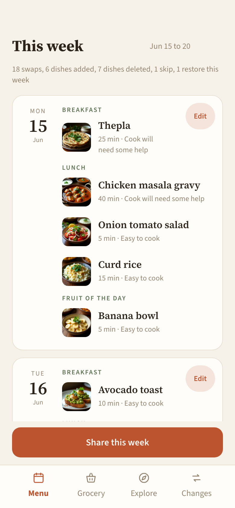
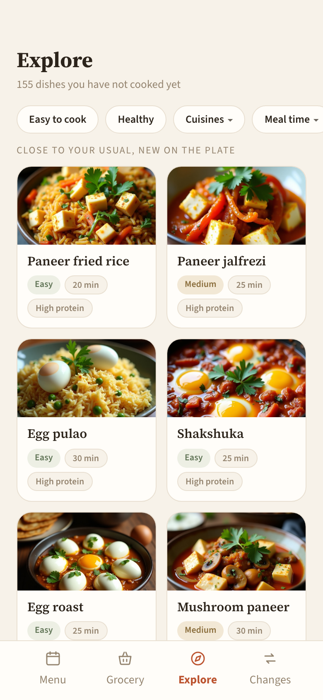
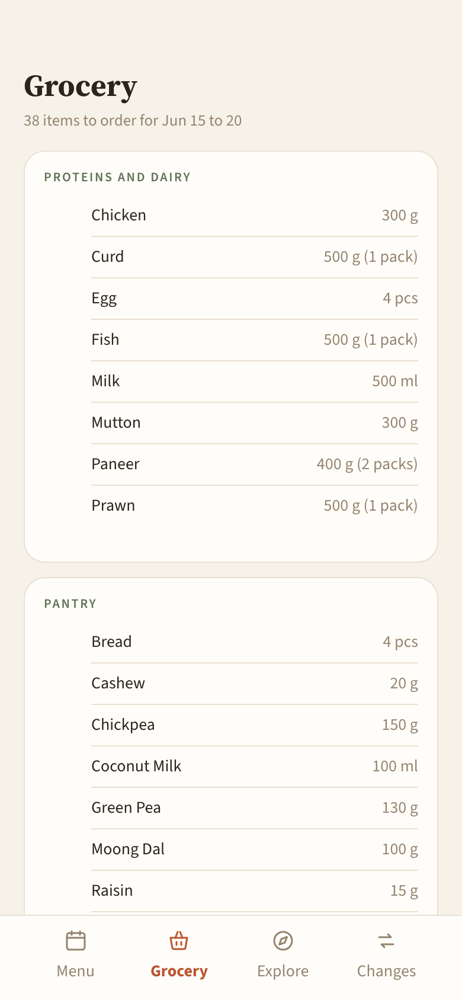

# Plantry

[](https://github.com/1729rpm/plantry/actions/workflows/ci.yml)


A weekly meal planner for a small household, built as an installable Progressive Web App (PWA). Every week Plantry reads a fixed dish library and a set of composition rules, generates a Monday-to-Saturday menu of breakfasts and lunches, and produces a shareable menu image and an aggregated grocery list. Sunday is a rest day. In-week edits (swap, add, custom dish, skip) are immediate and reversible; deeper changes to the library and rules flow through a separate, human-approved review loop.

## Screenshots

<p align="center">
  
  &nbsp;
  
  &nbsp;
  
</p>

<p align="center"><em>The Menu, Explore, and Grocery tabs.</em></p>

## What it does

- **Generates a full week.** A deterministic TypeScript engine reads the dish library, the rules, the current season, and recent history, then produces a valid Mon-to-Sat menu plus a grocery list. Each day also carries an in-season "fruit of the day".
- **Stays shareable.** The week renders to a family of images (a menu image and per-dish recipe sheets) that go out through the phone's native share sheet, so the plan lands in a chat at the start of the week.
- **Builds the grocery list automatically.** Ingredients are aggregated across the week, grouped in a fixed shopping order, and rounded up to whole pack sizes. Common pantry staples are omitted unless a dish explicitly needs them. The list is skip-aware: a skipped day contributes nothing.
- **Supports in-week edits.** Either user can swap a dish (via a ranked picker over the matching library), add a dish, drop in a custom dish, delete a dish, skip a whole day and restore it later, or save a dish for next week. Every edit records an author, a timestamp, and a reason.
- **Surfaces new dishes.** An Explore feed ranks dishes the household has not cooked yet, "familiar but new": novelty that still resembles what the household actually cooks. Multi-select filters narrow the grid, and anything already planned or saved is hidden.
- **Keeps a running record.** A Changes feed lists every edit and comment for the week, newest first, in plain language.

The app is organised as four tabs: **Menu**, **Grocery**, **Explore**, and **Changes**.

## How it is built

Plantry is structured around a clean split between a pure rules engine, a backend, and a frontend.

- **Engine** (`engine/`): a pure-function TypeScript module that holds all meal-planning logic (selection, composition, no-repeat recency, grocery aggregation). It is imported by both the backend and the tests, and it mirrors a human-readable rules spec. Continuous integration fails if the spec and the code drift apart.
- **Backend** (`app/convex/`): [Convex](https://www.convex.dev/) schema and server functions hold the live week, the edit log, and the queued feedback.
- **Frontend** (`app/web/`): a [Vite](https://vitejs.dev/) + React + TypeScript PWA, with a service worker for offline-tolerant, installable use.
- **Data** (`data/`): a human-edited, version-controlled dish library, ingredient catalog, and history seed. This is the target of the slow review loop.

### Two loops, never one

A core design idea is the separation of a fast loop from a slow loop.

- The **fast loop** is operational and immediate: swaps, adds, custom dishes, deletes, skips, saves, and dislikes, each applied to a single week and easily undone.
- The **slow loop** is structural and human-approved: changes to the dish library, the rules, or the engine. Feedback that implies a structural change is recorded, not applied; it only takes effect through a reviewed pull request.

The fast loop never silently mutates the rules. This keeps day-to-day use frictionless while ensuring that anything affecting every future week passes through review.

## Design principles

Every change is judged against a small set of rules, including:

- **Right-size the fix.** Solve a problem at the smallest level that works (a data row before a new column, a tag before a cross-cutting rule, a UI affordance before a rule at all). Do not generalize from one or two cases.
- **Solve structurally, not by name.** Encode the property that makes a special case special, rather than matching on dish names.
- **Record, do not apply.** Feedback that implies structural change is queued for the slow loop, never applied mid-week.
- **Decouple display from structure.** Internal labels never leak into user-facing output.
- **Reversibility first.** Fast-loop actions are easy to undo; slow-loop actions are not, so they always pass through human approval.

## Repository layout

```
engine/        Pure TypeScript meal-planning engine (rules live here)
app/convex/    Convex backend: schema and server functions
app/web/       Vite + React + TypeScript PWA
data/          Version-controlled dish library, ingredients, history
docs/          Canonical specs: product, engine, engineering, development
```

## Status

Plantry runs as a live PWA for a single household. The dish library spans roughly 260 dishes across about ten cuisines, each with a description, recipe, complexity marker, derived macros, and sourcing metadata. Future directions include day-level overrides for travel and eating out, calendar-aware generation, and grocery-ordering automation.
